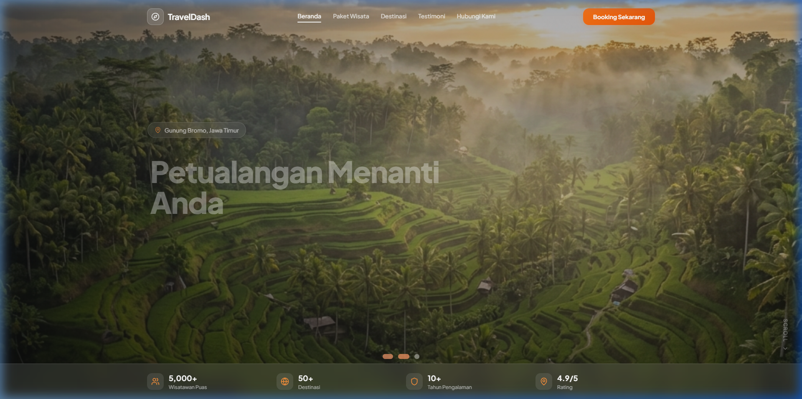
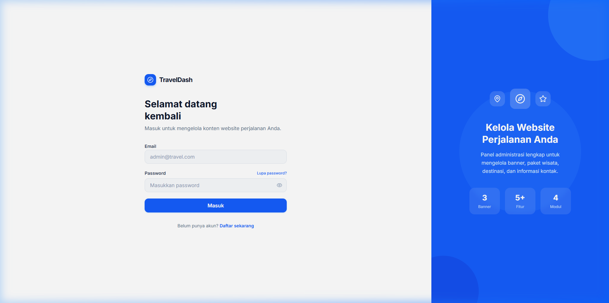

<p align="center">
  
</p>

<h1 align="center">🌍 TravelDash — Fullstack Travel Platform</h1>

<p align="center">
  A complete travel agency platform built with <strong>NestJS</strong>, <strong>React</strong>, <strong>MongoDB</strong>, and <strong>TailwindCSS</strong>.<br/>
  Featuring a public landing page, admin dashboard, and RESTful API backend.
</p>

<p align="center">
  <a href="https://travel2-ruddy.vercel.app">🌐 Live Site</a> •
  <a href="https://dashboard-travel2.vercel.app">📊 Dashboard</a> •
  <a href="https://travel2-api.onrender.com">🔧 API</a>
</p>

---

## ✨ Features

### 🌐 Landing Page (`/travel2`)
- **Hero Banner Slider** — Dynamic banners with GSAP animations, auto-slide, and location badges
- **Travel Packages** — Cards with pricing in IDR, duration, and WhatsApp booking integration
- **Popular Destinations** — Image gallery with hover effects
- **Testimonials** — Customer reviews with star ratings
- **Contact Form** — Direct communication channel
- **Fully Responsive** — Mobile-first design with smooth scroll animations

### 📊 Admin Dashboard (`/dashboard/dashboard-travel2`)
- **Authentication** — JWT-based login/register with role-based access (Owner/Admin)
- **Hero Banner Manager** — CRUD for homepage banners with Cloudinary image upload
- **Package Editor** — Manage travel packages (title, description, price, duration, images)
- **Destination Manager** — Add/edit/delete popular destinations
- **Contact Info Editor** — Update WhatsApp, phone, email, and office address
- **User Management** — Owner-only admin panel for managing user accounts
- **Password Recovery** — Forgot password flow with email reset links

### 🔧 Backend API (`/dashboard/nestjs`)
- **RESTful API** — Full CRUD for banners, cards, destinations, contacts, and users
- **Authentication** — JWT + Passport with bcrypt password hashing
- **Email Service** — Nodemailer integration for password reset emails
- **Validation** — Request validation with class-validator DTOs
- **MongoDB** — Mongoose ODM with MongoDB Atlas

---

## 🏗️ Architecture

```
fullstack-travel/
├── travel2/                          # 🌐 Landing Page (Vite + React + TailwindCSS)
│   ├── src/
│   │   ├── components/               # HeroSection, Packages, Destinations, etc.
│   │   ├── hooks/                    # Custom animation hooks
│   │   └── constant/                 # API base URL config
│   └── public/images/                # Static assets
│
├── dashboard/
│   ├── dashboard-travel2/            # 📊 Admin Dashboard (Vite + React + TailwindCSS)
│   │   ├── src/
│   │   │   ├── components/           # Content editors, UI components, layout
│   │   │   ├── contexts/             # AuthContext (JWT auth state)
│   │   │   ├── pages/                # Login, Register, Content, Admin pages
│   │   │   └── lib/                  # API client with auth headers
│   │   └── public/
│   │
│   └── nestjs/                       # 🔧 Backend API (NestJS + MongoDB)
│       └── src/
│           ├── auth/                 # JWT auth, login, register, password reset
│           ├── banners/              # Hero banner CRUD
│           ├── cards/                # Travel package CRUD
│           ├── destinations/         # Destination CRUD
│           ├── contacts/             # Contact info CRUD
│           ├── users/                # User management CRUD
│           └── schemas/              # Mongoose schemas
```

---

## 🛠️ Tech Stack

| Layer | Technology |
|-------|-----------|
| **Frontend** | React 19, TypeScript, TailwindCSS 4, Vite 8 |
| **Animations** | GSAP + ScrollTrigger |
| **Backend** | NestJS 11, TypeScript |
| **Database** | MongoDB Atlas (Mongoose 9) |
| **Auth** | JWT + Passport + bcrypt |
| **Email** | Nodemailer |
| **Image Upload** | Cloudinary |
| **Icons** | Lucide React |
| **Hosting** | Vercel (frontends) + Render (backend) |

---

## 🚀 Getting Started

### Prerequisites

- **Node.js** >= 18
- **MongoDB** instance (local or [MongoDB Atlas](https://www.mongodb.com/atlas))
- **Cloudinary** account (for image uploads in the dashboard)

### 1. Clone the repository

```bash
git clone https://github.com/Arezafaza16/fullstack-travel.git
cd fullstack-travel
```

### 2. Set up the Backend

```bash
cd dashboard/nestjs
npm install
cp .env.example .env
# Edit .env with your actual values (see Environment Variables below)
npm run start:dev
```

The API will be running at `http://localhost:3000`

### 3. Set up the Landing Page

```bash
cd travel2
npm install
cp .env.example .env
# Edit .env — set VITE_BACKEND_API=http://localhost:3000
npm run dev
```

The landing page will be at `http://localhost:5173`

### 4. Set up the Admin Dashboard

```bash
cd dashboard/dashboard-travel2
npm install
cp .env.example .env
# Edit .env — set VITE_API_URL=http://localhost:3000
npm run dev
```

The dashboard will be at `http://localhost:5174`

---

## 🔐 Environment Variables

### Backend (`dashboard/nestjs/.env`)

| Variable | Description | Example |
|----------|-------------|---------|
| `JWT_SECRET` | Secret key for JWT token signing | `your_strong_random_secret` |
| `MAIL_USER` | Gmail address for sending emails | `you@gmail.com` |
| `MAIL_PASS` | Gmail App Password | `abcd efgh ijkl mnop` |
| `PORT` | Server port | `3000` |
| `FRONTEND_URL` | Dashboard URL (for password reset links) | `http://localhost:5173` |
| `MONGODB_URI` | MongoDB connection string | `mongodb+srv://...` |
| `ALLOWED_ORIGINS` | Comma-separated allowed CORS origins | `http://localhost:5173,http://localhost:5174` |

### Dashboard Frontend (`dashboard/dashboard-travel2/.env`)

| Variable | Description | Example |
|----------|-------------|---------|
| `VITE_API_URL` | Backend API base URL | `http://localhost:3000` |
| `VITE_CLOUDINARY_CLOUD_NAME` | Cloudinary cloud name | `your_cloud_name` |
| `VITE_CLOUDINARY_UPLOAD_PRESET` | Cloudinary unsigned upload preset | `your_preset` |

### Landing Page (`travel2/.env`)

| Variable | Description | Example |
|----------|-------------|---------|
| `VITE_BACKEND_API` | Backend API base URL | `http://localhost:3000` |

---

## 📡 API Endpoints

### Authentication
| Method | Endpoint | Description |
|--------|----------|-------------|
| `POST` | `/auth/register` | Register a new user |
| `POST` | `/auth/login` | Login and get JWT token |
| `POST` | `/auth/forgot-password` | Send password reset email |
| `POST` | `/auth/reset-password` | Reset password with token |

### Banners
| Method | Endpoint | Description |
|--------|----------|-------------|
| `GET` | `/banners` | Get all banners |
| `POST` | `/banners` | Create a new banner |
| `PUT` | `/banners/:id` | Update a banner |
| `DELETE` | `/banners/:id` | Delete a banner |

### Cards (Travel Packages)
| Method | Endpoint | Description |
|--------|----------|-------------|
| `GET` | `/cards` | Get all travel packages |
| `POST` | `/cards` | Create a new package |
| `PUT` | `/cards/:id` | Update a package |
| `DELETE` | `/cards/:id` | Delete a package |

### Destinations
| Method | Endpoint | Description |
|--------|----------|-------------|
| `GET` | `/destinations` | Get all destinations |
| `POST` | `/destinations` | Create a new destination |
| `PUT` | `/destinations/:id` | Update a destination |
| `DELETE` | `/destinations/:id` | Delete a destination |

### Contacts
| Method | Endpoint | Description |
|--------|----------|-------------|
| `GET` | `/contacts` | Get contact info |
| `POST` | `/contacts` | Create contact info |
| `PUT` | `/contacts/:id` | Update contact info |
| `DELETE` | `/contacts/:id` | Delete contact info |

### Users (Admin only)
| Method | Endpoint | Description |
|--------|----------|-------------|
| `GET` | `/users` | Get all users |
| `GET` | `/users/:id` | Get user by ID |
| `POST` | `/users` | Create a new user |
| `PUT` | `/users/:id` | Update a user |
| `DELETE` | `/users/:id` | Delete a user |

---

## 🖼️ Screenshots

### Landing Page


### Admin Dashboard


---

## 📄 License

This project is unlicensed — feel free to use it for learning and personal projects.
